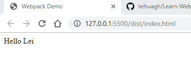

# Configuring `html-webpack-plugin`

## Install `html-webpack-plugin`

```shell
npm add -D html-webpack-plugin
```

## Config Webpack

### Create Webpack Configure File

```shell
touch webpack.config.js
```

### Fill-in `webpack.config.js`

```javascript
const HtmlWebpackPlugin = require('html-webpack-plugin')

const webpackConfig = {
  plugins: [
    new HtmlWebpackPlugin({
      title: 'Webpack Demo'
    })
  ]
}

module.exports = webpackConfig
```

## Executing Webpack

### Command

```shell
.\node_modules\.bin\webpack --mode production
```

### Results

```shell
Hash: 7d0a290856de73566ab2
Version: webpack 4.33.0
Time: 1465ms
Built at: 06/05/2019 10:18:45 PM
     Asset       Size  Chunks             Chunk Names
index.html  181 bytes          [emitted]
   main.js   1.05 KiB       0  [emitted]  main
Entrypoint main = main.js
[0] ./src/index.js + 1 modules 234 bytes {0} [built]
    | ./src/index.js 88 bytes [built]
    | ./src/component.js 146 bytes [built]
Child html-webpack-plugin for "index.html":
     1 asset
    Entrypoint undefined = index.html
    [2] (webpack)/buildin/global.js 472 bytes {0} [built]
    [3] (webpack)/buildin/module.js 497 bytes {0} [built]
        + 2 hidden modules
```

## Files are Generated\

- Run `dist/index.html` using `Live Server`



## Add a Build Shortcut

`package.json`

```json
{
    ...
    "scripts": {
        "build": "webpack --mode production"
    }
    ...
}
```

## Run Shortcut

### Command

```shell
npm run build
```

### Results

```shell
> tutorial005@1.0.0 build C:\projects\webpack\tutorials\tutorial005 > webpack --mode production

Hash: 7d0a290856de73566ab2
Version: webpack 4.33.0
Time: 1222ms
Built at: 06/05/2019 10:55:07 PM
     Asset       Size  Chunks             Chunk Names
index.html  181 bytes          [emitted]
   main.js   1.05 KiB       0  [emitted]  main
Entrypoint main = main.js
[0] ./src/index.js + 1 modules 234 bytes {0} [built]
    | ./src/index.js 88 bytes [built]
    | ./src/component.js 146 bytes [built]
Child html-webpack-plugin for "index.html":
     1 asset
    Entrypoint undefined = index.html
    [2] (webpack)/buildin/global.js 472 bytes {0} [built]
    [3] (webpack)/buildin/module.js 497 bytes {0} [built]
        + 2 hidden modules
```
