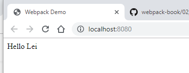
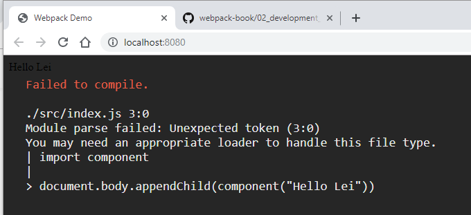

# Enabling Error Overlay

## Setup Error Overlay

`webpack.config.js`

```javascript
const HtmlWebpackPlugin = require('html-webpack-plugin')

const webpackConfig = {
  devServer: {
    stats: 'errors-only',
    host: process.env.HOST, // Default to `localhost`
    port: process.env.PORT, // Default to 8080
    open: true,
    overlay: true
  },
  plugins: [
    new HtmlWebpackPlugin({
      title: 'Webpack Demo'
    })
  ]
}

module.exports = webpackConfig
```

## Executing Webpack Development

```shell
npm start
```

## Results on Browser

`http://localhost:8080`



## Making Error

`src/index.js`

- Remove first line `from './component'`



## Remove the Error

`src/index.js`

```javascript
import component from './component'

document.body.appendChild(component('Hello Lei'))
```
