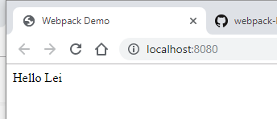

# Composing Configuration

## Install `webpack-merge`

```shell
npm add -D webpack-merge
```

## Webpack Parts Configuration File

```shell
touch webpack.parts.js
```

`webpack.parts.js`

```javascript
exports.devServer = ({ host, port } = {}) => ({
  devServer: {
    stats: 'errors-only',
    host, // default to `localhost`
    port, // default to `8080`
    open: true,
    overlay: true
  }
})
```

## Modify Webpack Configure File

`webpack.config.js`

```javascript
const merge = require('webpack-merge')
const HtmlWebpackPlugin = require('html-webpack-plugin')
const parts = require('./webpack.parts')

const baseConfig = merge([
  {
    plugins: [
      new HtmlWebpackPlugin({
        title: 'Webpack Demo'
      })
    ]
  }
])

const productionConfig = merge([])

const developmentConfig = merge([
  parts.devServer({
    host: process.env.HOST,
    part: process.env.PORT
  })
])

module.exports = mode => {
  if (mode === 'production') {
    return merge(baseConfig, productionConfig, {
      mode
    })
  }

  return merge(baseConfig, developmentConfig, {
    mode
  })
}
```

## Modify Script

`package.json`

```json
{
  "name": "tutorial005",
  "version": "1.0.0",
  "private": true,
  "description": "Learn Webpack",
  "main": "index.js",
  "scripts": {
    "start": "webpack-dev-server --env development",
    "build": "webpack --end production"
  },
  "repository": {
    "type": "git",
    "url": "git+https://github.com/leihuagh/Learn-Webpack-from-Book.git"
  },
  "keywords": [],
  "author": "Lei Hua",
  "license": "MIT",
  "bugs": {
    "url": "https://github.com/leihuagh/Learn-Webpack-from-Book/issues"
  },
  "homepage": "https://github.com/leihuagh/Learn-Webpack-from-Book#readme",
  "devDependencies": {
    "html-webpack-plugin": "^3.2.0",
    "webpack": "^4.33.0",
    "webpack-cli": "^3.3.2",
    "webpack-dev-server": "^3.7.0",
    "webpack-merge": "^4.2.1"
  }
}
```

## Executing Webpack

### Run Development

```shell
 npm start

> tutorial005@1.0.0 start C:\projects\webpack\tutorials\tutorial005 > webpack-dev-server --env development

i ｢wds｣: Project is running at http://localhost:8080/
i ｢wds｣: webpack output is served from /
i ｢wds｣: Content not from webpack is served from C:\projects\webpack\tutorials\tutorial005
i ｢wdm｣: wait until bundle finished: /
i ｢wdm｣:
i ｢wdm｣: Compiled successfully.
```


