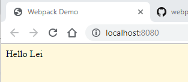

# Loading CSS

## Install Packages

```shell
npm add -D style-loader css-loader
```

## Configuration

`webpack.parts.js`

```javascript
exports.loadCSS = ({ include, exclude } = {}) => ({
  module: {
    rules: [
      {
        test: /\.css$/,
        include,
        exclude,

        use: ['style-loader', 'css-loader']
      }
    ]
  }
})
```

`webpack.config.js`

```javascript
const baseConfig = merge([
  {
    plugins: [
      new HtmlWebpackPlugin({
        title: 'Webpack Demo'
      })
    ]
  },
  parts.loadCSS()
])
```

## Create Style File

```shell
cd src
touch main.css
cd ..
```

`src/main.css`

```css
body {
  background: cornsilk;
}
```

## Link Style File to Default JavaScript File

`src/index.js`

```javascript
import component from './component'
import './main.css'

document.body.appendChild(component('Hello Lei'))
```

## Executing Webpack

```shell
npm start

> tutorial005@1.0.0 start C:\projects\webpack\tutorials\tutorial005 > webpack-dev-server --env development

i ｢wds｣: Project is running at http://localhost:8080/
i ｢wds｣: webpack output is served from /
i ｢wds｣: Content not from webpack is served from C:\projects\webpack\tutorials\tutorial005
i ｢wdm｣: wait until bundle finished: /
i ｢wdm｣:
i ｢wdm｣: Compiled successfully.
```


