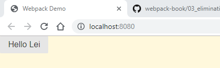
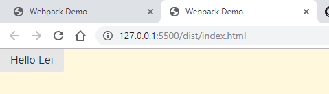

# Eliminating Unused CSS

## Install `Pure.css`

```shell
npm add -S purecss
```

## Import `purecss`

`src/index.js`

```javascript
import 'purecss'
import component from './component'
import './main.css'

document.body.appendChild(component('Hello Lei'))
```

## Add Style Class

`src/component.js`

```javascript
export default (text = 'Hello World') => {
  const element = document.createElement('div')
  element.className = 'pure-button'
  element.innerHTML = text
  return element
}
```

## Run on Development Mode

### Run Server

```shell
npm start

> tutorial005@1.0.0 start C:\projects\webpack\tutorials\tutorial005 > webpack-dev-server --env development

i ｢wds｣: Project is running at http://localhost:8080/
i ｢wds｣: webpack output is served from /
i ｢wds｣: Content not from webpack is served from C:\projects\webpack\tutorials\tutorial005
i ｢wdm｣: wait until bundle finished: /
i ｢wdm｣:
i ｢wdm｣: Compiled successfully.
```



## Run Production Mode

### Executing Code

```shell
npm run build

> tutorial005@1.0.0 build C:\projects\webpack\tutorials\tutorial005 > webpack --end production

Hash: c06e5b7f2b2018f8997b
Version: webpack 4.33.0
Time: 2112ms
Built at: 06/07/2019 11:25:28 PM
     Asset       Size  Chunks             Chunk Names
index.html  181 bytes          [emitted]
   main.js   23.2 KiB       0  [emitted]  main
Entrypoint main = main.js
[5] ./src/main.css 1.05 KiB {0} [built]
[6] ./node_modules/css-loader/dist/cjs.js!./src/main.css 179 bytes {0} [built]
[7] ./src/index.js + 1 modules 322 bytes {0} [built]
    | ./src/index.js 127 bytes [built]
    | ./src/component.js 185 bytes [built]
    + 5 hidden modules

WARNING in configuration
The 'mode' option has not been set, webpack will fallback to 'production' for this value. Set 'mode' option to 'development' or 'production' to enable defaults for each environment.
You can also set it to 'none' to disable any default behavior. Learn more: https://webpack.js.org/configuration/mode/
Child html-webpack-plugin for "index.html":
     1 asset
    Entrypoint undefined = index.html
    [2] (webpack)/buildin/global.js 472 bytes {0} [built]
    [3] (webpack)/buildin/module.js 497 bytes {0} [built]
        + 2 hidden modules
```

### Run `dist/index.html` Under Live Server


